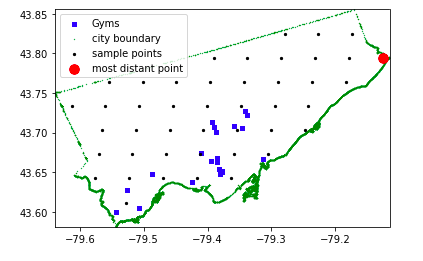

title: Where to start my business in Toronto?

# Introduction

##### Business/Data Science Question
If an entrepeneur wants to open a business in Toronto, how can we help him/her with our data to find the most profitable location? 

The most profitable location is often facing less competition, e.g. a business owner of an italian Restaurant might look for locations where no other italian Restaurants are in the near. 
On the other side, every city faces the problem that some buisnesses are highly concentrated in a few neighbourhoods, more traffic is the result.

This Reports aims to solve this problem for the City of Toronto. An entrepeneur can chose his/her business from a list and our system will show him/her the best location for his/her new business together with public information about this new location.

# Data
Income data about the neighbourhoods in Toronto and general geo location data about Toronto and location data about venues in Toronto from _Foursquare_ will be used to answer the question wether a location is profitable to start a business or not. The question will be answered for any business which exists as a venue category on _Foursquare_. 
_Foursquare_ Data consists of geo codes (longitudes and latitudes) and veneue categories (e.g.: "italian restaurant"). Toronto Neighbourhood Data defines the boundary for the final product: venues only within the city boundary of Toronto will be considered. This data gives also everage income per houshold on a neighbourhood level.

# Methodology
The underlying model uses the _Manhattan_ or L1 distance matrix.

# Results
The following image visualizes the use of the system:

# Discussion
The System can and will be further developed. These enhancements are thinkable:

- displaying more geo information of the new location 
- using different distance matrix (like euclidian distance)
- consideration of traffic
- connection to a database with available business spaces
- a web system where the system can be easily accessed

# Conclusion
This Report and the underlying Data Analysis shows how Entrepeneurs can be helped by very simple means in Toronto. 

## Data Sources
- [Toronto Neighbourhood Profiles](https://open.toronto.ca/dataset/neighbourhood-profiles/), direct link to datasets I used (accessed: 2020-03-06):
	- [neighbourhood-profiles-2016-csv](https://ckan0.cf.opendata.inter.prod-toronto.ca/download_resource/ef0239b1-832b-4d0b-a1f3-4153e53b189e?format=csv)
	- [neighbourhood-profiles-2016-readme](https://ckan0.cf.opendata.inter.prod-toronto.ca/download_resource/bae6a4f1-09f2-44c6-8567-8ee28603c5cf?format=csv)
- [Foursquare API Data](https://developer.foursquare.com/docs)
- [List of postal codes of Canada (wikipedia)](https://en.wikipedia.org/wiki/List_of_postal_codes_of_Canada:_M)
